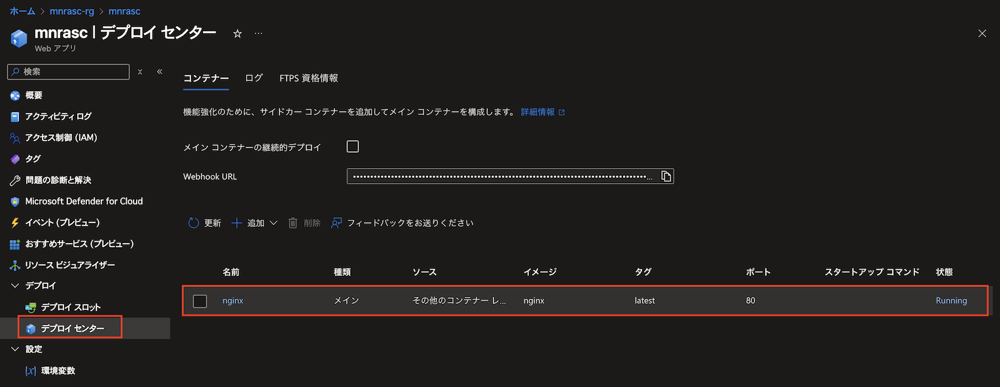

Azure App Service のマルチコンテナーアプリは、プレビューの Docker Compose で対応可能です。

カスタムコンテナーは後継の機能なので、Docker Compose はプレビューのまま終わってしまうのでしょうか。

そこで今回は、後継のサイドカーコンテナーにも対応したカスタムコンテナー機能を Azure CLI で試してみました。

## Azure CLI のバージョン確認

バージョン 2.70.0 からカスタムコンテナーに対応しています。

```bash
$ az version
{
  "azure-cli": "2.70.0",
  "azure-cli-core": "2.70.0",
  "azure-cli-telemetry": "1.1.0",
  "extensions": {}
}
```

## App Service Plan を作成するところまでは既存と同じ

```bash
prefix=mnrasc
region=japaneast

az group create \
  --name ${prefix}-rg \
  --location $region

az appservice plan create \
  --name ${prefix}-plan \
  --resource-group ${prefix}-rg \
  --sku B1 \
  --is-linux
```

## カスタムコンテナー対応の Web アプリを作成

```bash
az webapp create \
  --name ${prefix} \
  --resource-group ${prefix}-rg \
  --plan ${prefix}-plan \
  --sitecontainers-app
```

## メインのカスタムコンテナーを Nginx で作成

```bash
az webapp sitecontainers create \
  --name ${prefix} \
  --resource-group ${prefix}-rg \
  --container-name nginx \
  --image nginx \
  --target-port 80 \
  --is-main true
```

## Azure ポータルでカスタムコンテナーを確認



## （おまけ）常時接続設定

```bash
az webapp config set \
  --name ${prefix} \
  --resource-group ${prefix}-rg \
  --always-on true
```

## 検証が終わったら後片付け

```bash
az group delete \
  --name ${prefix}-rg \
  --yes
```

## 参考

[Azure CLI バージョン 2.70.0 リリースノート](https://learn.microsoft.com/ja-jp/cli/azure/release-notes-azure-cli#march-04-2025)

[az webapp sitecontainers](https://learn.microsoft.com/en-us/cli/azure/webapp/sitecontainers?view=azure-cli-latest)
